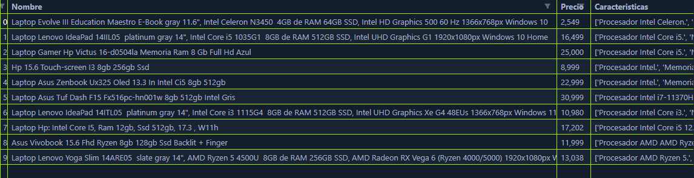

# Scraper de laptops de Mercado Libre

Este script en Python permite extraer información de laptops del sitio web de Mercado Libre, almacenarla en un archivo CSV y generar un reporte para su análisis posterior.

## Requisitos

- requests
- beautifulsoup4
- pandas

## Instalación

1. Clona el repositorio desde GitHub:
```bash
git clone https://github.com/brianrscode/python-laptop-scraper.git
```
2. Instala las librerías necesarias desde la línea de comandos:
```bash
pip install -r requirements.txt
```

## Uso

1. Abre una terminal y navega al directorio donde se encuentra el archivo `main.py`:

2. Ejecuta el script:
```bash
python main.py
```
3. Espera a que el script termine de ejecutarse. Una vez finalizado, encontrarás un archivo CSV con la información extraída en el mismo directorio donde se encuentra `main.py`.

## Capturas de funcionamiento
**El script no siempre saca la misma cantidad de resultados**

